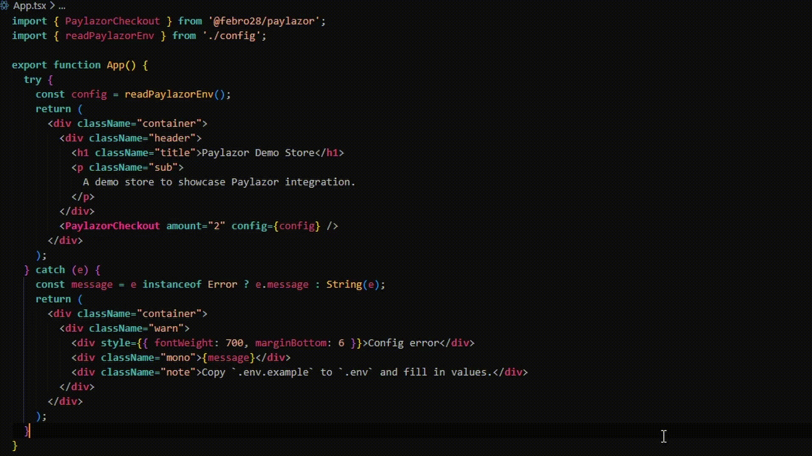

# Paylazor

<div align="center">
  <a href="https://x.com/febroriginal"></a>
  <a href="https://t.me/febri555"></a>
  
  <br />
  <a href="https://www.npmjs.com/package/@febro28/paylazor"></a>
  <a href="https://www.npmjs.com/package/@febro28/paylazor"></a>
  <a href="https://github.com/AganFebro/paylazor"></a>
  <a href="https://www.npmjs.com/package/@febro28/paylazor"></a>
</div>

<p align="center">
  
</p>

Paylazor is an embeddable **“Pay with Solana (USDC)” checkout widget for React** built on top of the LazorKit passkey wallet SDK and paymaster (gasless transactions). It’s designed to help you ship a working checkout flow quickly, without re-building the same UI states and Solana/USDC plumbing from scratch in every app.

**You can test the demo on Vercel**, click this button below:
<div align="center">
  <a href="https://paylazor-demo-store.vercel.app"></a>
  <br />
  </div>

## Integrate Paylazor into your website

[`Paylazor installation using pnpm`](README_PAYLAZOR_INSTALL.md)

## What is Paylazor?

Paylazor is an npm-published React checkout widget (`@febro28/paylazor`) that provides:

- A ready-to-use checkout UI (connect → confirm → paying → success/error)
- LazorKit wiring (portal + wallet session connect/restore)
- USDC transfer transaction building (SPL token transfer)
- Opinionated defaults for demo/devnet while still being configurable
- Typed config + error handling suitable for an npm package

You embed it as a component (`<PaylazorCheckout />`) and pass configuration + amount.
Source lives in [`packages/paylazor`](packages/paylazor) in this repo.

## Paylazor vs integrating LazorKit directly

If you integrate LazorKit directly (without Paylazor), you typically need to build and maintain:

- Checkout UI states, layout, and UX (loading, retry, error states)
- Passkey connect flow orchestration (portal URLs, window/iframe behavior, UX messaging)
- USDC transfer building (mint/decimals, ATA handling, SPL token instructions)
- Browser/polyfill quirks for Solana tooling (e.g., Buffer-related issues)
- Error normalization (actionable messages for users and logs for devs)
- A demo/reference implementation that others can follow

Paylazor’s goal is to package those pieces into a small, typed, reusable widget so your app focuses on product logic instead of plumbing.

## What this repo demonstrates

- Passkey-based wallet connect + session restore via LazorKit portal
- Gasless USDC payment (paymaster-sponsored `signAndSendTransaction`)
- A reusable “Pay with Solana (USDC)” widget (`packages/paylazor`)
- A Vite demo apps and demo portal

## Structure

- [`packages/paylazor`](packages/paylazor) — paylazor widget library source code (React)
- [`apps/demo-store`](apps/demo-store) — minimal Vite React demo
- [`apps/portal`](apps/portal) — self-hosted passkey portal (WebAuthn + postMessage)
- [`tutorials`](tutorials)

## Quick start (local dev)

```bash
pnpm install
cp .env.example .env
```

Set `VITE_MERCHANT_ADDRESS` in `.env` (a Solana public key).

```bash
pnpm --filter portal dev
pnpm --filter demo-store dev
```

Ports:
- Portal: `https://localhost:5174`
- Demo store: `https://localhost:5173`

Notes:
- `.env.example` defaults to Devnet + local portal (`VITE_LAZORKIT_PORTAL_URL=https://localhost:5174`).
- For production/self-hosted portals, set `VITE_PORTAL_ALLOWED_ORIGINS` in the portal deployment (see `README_PAYLAZOR_INSTALL.md`).

## Deploy locally

1. Open the demo store (`https://localhost:5173` or `https://localhost:5175`).
2. Click **Continue with passkey** and complete the portal prompt.
3. Fund the smart wallet’s USDC ATA (shown in the widget UI) with Devnet USDC for the configured mint.
4. Click **Pay now** and copy the transaction signature.

If something breaks:
- Read the tutorials below first.
- If you see `Buffer is not defined` or “module externalized”, follow the Vite troubleshooting in [README_PAYLAZOR_INSTALL.md](README_PAYLAZOR_INSTALL.md).

## Tutorials

- [Configuring Passkey Wallet](tutorials/01-passkey-wallet.md)
- [Configuring Gassless USDC Payment](tutorials/02-gasless-usdc-payment.md)

## Known Error

- **Transaction Size Too Large:**
Refresh the website and retry payment

- **Error Transaction Custom Program 0x2:**
Create a new wallet then funds with USDC